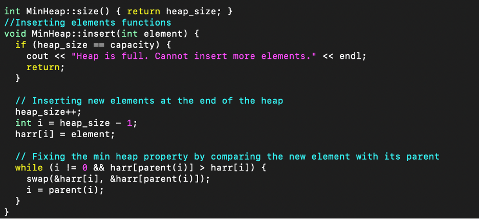

# Assignment 2: Min Heap Implementation

This repository contains the implementation of a min heap and its associated functionalities.

## Files Included

1. `inputs/` - Directory containing all input files.
2. `a.out` - Compiled executable file.
3. `demo.cpp` - Demo file showcasing the implementation.
4. `minheap.cpp` - Contains the core functions for the min heap.
5. `minheap.hpp` - Header file for the min heap.
6. `output` - File to store generated outputs.
7. `README.md` -  README of the instructions.
8. `TejaswiniSaiAvisana_Assignment2.pdf` - Detailed assignment document.

## Setup and Execution

### Initial Setup

1. Start by installing **PuTTY**.
2. Use **PuTTY** to access the CELL machine with your credentials.
3. Launch the **PuTTY** and establish a connection to your desired CELL CSE machine using its host name and your login details.
4. Once connected, transfer the entire code folder to your designated directory on the machine.

### Compilation and Execution

1. Set up **PuTTY** using the credentials.
2. To compile the code, use:  
   `g++ demo.cpp minheap.cpp`
3. To execute and measure the time, run:  
   `./a.out inputs/input.10.1`  
   For multiple input files and timing:  
   `for f in inputs/input.10*; do echo $f; ./a.out $f; done`  
   To capture the output into a file:  
   `time for f in inputs/input.10*; do echo $f; ./a.out $f; done > output`

## Code Functionality Overview

### Insert Function

- Inserts new elements into the heap and arranges them based on the min heap property.
- Before adding a new element, the function checks the heap's capacity.
- Upon addition, the element's position is adjusted to maintain the heap's integrity.

### Extract Function

- Removes and returns the smallest element from the heap.
- Before extraction, it checks if the heap is empty or has only a single element.
- After extraction, the heap's structure is adjusted to preserve its properties.

### Heapify Function

- Ensures proper heap organization, beginning from the root down to the child nodes.
- Compares the root with its children, making swaps as necessary to maintain the min heap property.

### Heapsort Function

- Performs sorting on the input array using the min heap.
- Constructs a min heap and extracts elements in ascending order, populating the input array.

